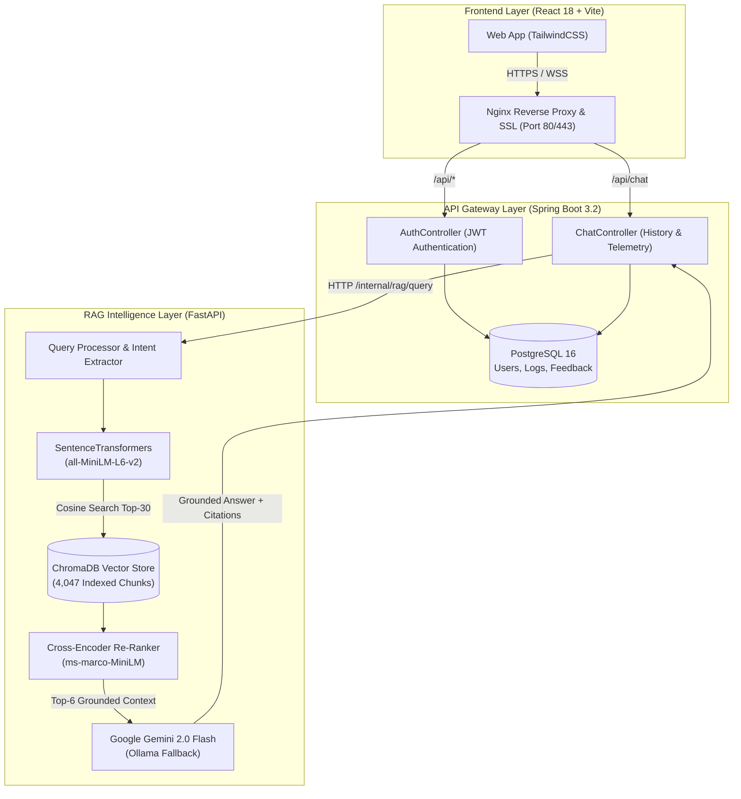

# 🏛️ ManakAI — Evidence-First BIS Regulatory Intelligence Platform

<div align="center">

[](https://sih.gov.in)
[](https://manak-ai.duckdns.org)
[-6DB33F.svg?style=for-the-badge&logo=springboot&logoColor=white)](https://spring.io/projects/spring-boot)
[-009688.svg?style=for-the-badge&logo=fastapi&logoColor=white)](https://fastapi.tiangolo.com)
[](https://react.dev)
[](https://docker.com)

**AI-Powered Regulatory Assistant & Compliance Engine for the Bureau of Indian Standards (BIS)**  
*Smart India Hackathon 2026 • Problem Statement: SIH26107 • Team BISync*

---

[🌐 **Live Application**](https://manak-ai.duckdns.org) • [📖 **System Architecture**](#-system-architecture) • [⚡ **Quickstart**](#-quick-start-with-docker) • [💡 **Try Sample Queries**](#-tested-demo-queries)

</div>

---

## 📌 Executive Summary

Navigating over **22,000 Indian Standards (IS)**, technical amendments, and gazette notifications is a formidable hurdle for Indian manufacturers, MSMEs, startups, and regulatory inspectors. Finding exact chemical permissible limits, safety tolerances, or mandatory testing procedures typically demands manually combing through dense, technical PDFs.

Generic LLMs fail in regulatory environments because they **hallucinate technical specifications**, invent non-existent clause numbers, and lack auditable provenance.

**ManakAI** solves this challenge through an enterprise-grade, **evidence-first Retrieval-Augmented Generation (RAG)** platform. Every claim is strictly grounded in verified BIS standard documentation and cited at the exact **Clause and Page level**. If verifiable evidence is absent, the system's **Hallucination Guard** proactively abstains rather than inventing misleading data.

---

## 🌟 Core Workspaces

### 1. 💬 Ask ManakAI (RAG Assistant)
* **Clause-Level Citations:** Formulates exact answers citing authoritative clauses (e.g. `[IS 269:2015, Clause 4.1]`).
* **Evidence Quality Rating:** Dynamically scores answers with an **Evidence Confidence Meter** (e.g. *Strong Evidence 86%*).
* **Interactive Evidence Dossier:** Inspect the raw BIS standard text snippet, metadata, and gazette sources directly within the UI.
* **Strict Hallucination Guard:** Automatically abstains if cosine relevance falls below threshold.

### 2. 🔍 Find Applicable Indian Standard
* **Semantic Discovery:** Describe products or materials in natural language (e.g. *"high strength deformed steel bars"* or *"commercial induction stove"*).
* **Scheme Identification:** Automatically determines mandatory schemes (**ISI Scheme I**, **CRS Scheme II**, or **FMCS**).
* **Rationale Breakdown:** Provides clear, bulleted justifications for why a standard applies to the specific product.

### 3. 📊 Admin Analytics & Governance Dashboard
* **Telemetry Monitoring:** Live tracking of total queries, latency percentiles, and positive feedback ratings.
* **Knowledge Base Health:** Real-time visibility into the vector store—currently indexing **4,047 verified clause chunks across 15 priority standards**.
* **Knowledge Gap Triage:** Flags queries that returned low confidence, providing BIS regulatory officers with actionable insights on where clearer documentation or standards are needed.

---

## 🏗️ System Architecture



---

## 🛠️ Technology Stack

| Component | Technology | Rationale |
|:---|:---|:---|
| **Frontend** | React 18, TypeScript, TailwindCSS, Lucide Icons | Responsive, accessible, audit-focused UI with sub-second page transitions. |
| **API Gateway** | Spring Boot 3.2.1, Java 17, Spring Security | Enterprise-grade JWT authentication, query audit logging, and transactional safety. |
| **Database** | PostgreSQL 16 (Alpine) | ACID-compliant storage for users, chat sessions, feedback, and telemetry logs. |
| **RAG Service** | FastAPI, Python 3.11, Pydantic v2 | High-concurrency asynchronous endpoints for vector retrieval and re-ranking. |
| **Vector Database** | ChromaDB (v0.5+) | High-performance embedded vector store persisting 4,047 indexed BIS clauses. |
| **Embeddings** | `sentence-transformers/all-MiniLM-L6-v2` | Dense 384-dimensional embeddings optimized for technical and legal prose. |
| **Re-Ranking** | `cross-encoder/ms-marco-MiniLM-L-6-v2` | Two-stage re-ranking to prioritize exact regulatory clauses over keyword matches. |
| **LLM Engine** | Google Gemini 2.0 Flash (with local Ollama fallback) | Ultra-fast inference with strict system prompts enforcing zero-hallucination. |
| **Deployment** | Docker Compose, Nginx, Let's Encrypt SSL | Multi-container automated orchestration on Google Cloud Platform (GCP). |

---

## 🧪 Tested Demo Queries

Try these pre-verified technical queries in the live chat:

| Query | Applicable Standard | Verified Output & Citations |
|:---|:---|:---|
| *"What are the key requirements under IS 269 for Cement Quality?"* | **IS 269:2015** | Lime-to-silica ratio (0.66–1.02), Magnesia $\le 6\%$, Insoluble residue $\le 4\%$ `[Clause 4.1]`, 90μ sieve residue `[Clause 5.1]` |
| *"What are the safety requirements for self-ballasted LED lamps under IS 16102?"* | **IS 16102 (Part 1)** | Fault conditions `[Clause Cl-13]`, insulation resistance, and dielectric strength requirements. |
| *"What are the permissible limits for drinking water under IS 10500:2012?"* | **IS 10500:2012** | pH limits (6.5–8.5), Total Dissolved Solids (500–2000 mg/L), Turbidity (1–5 NTU). |
| *"What are the requirements for plugs and socket-outlets rated up to 250V under IS 1293?"* | **IS 1293:2019** | Pin dimensions, temperature rise limits, and mandatory ISI certification scheme. |

---

## 🚀 Quick Start with Docker

### 1. Clone Repository & Setup Environment
```bash
git clone https://github.com/Shivang1109/MANAK_ai.git
cd MANAK_ai

# Create your environment file from the template
cp .env.example .env
```

### 2. Configure Environment (`.env`)
```ini
# Database Settings
POSTGRES_DB=manakai
POSTGRES_USER=manakai_user
POSTGRES_PASSWORD=your_secure_password

# Authentication & Services
JWT_SECRET=your-256-bit-secret-key-change-this-in-production
ALLOWED_ORIGINS=http://localhost:3000,http://localhost:80,https://manak-ai.duckdns.org

# AI / LLM Keys (Gemini Flash is free at https://aistudio.google.com)
GOOGLE_API_KEY=your_gemini_api_key_here
```

### 3. Launch with Docker Compose
```bash
docker compose up -d --build
```

The stack will start and expose:
- **Frontend & Reverse Proxy:** `http://localhost` (or `http://localhost:3000`)
- **Backend API Gateway:** `http://localhost:8080/api`
- **RAG Engine:** `http://localhost:8000/health`
- **PostgreSQL Database:** `localhost:5432`

---

## 📁 Repository Structure

```text
MANAK_ai/
├── docker-compose.yml          # Production multi-container orchestration
├── .env.example                # Unified environment template
├── docs/                       # Presentation & evaluation reference docs
│   ├── DEPLOYMENT_GUIDE.md     # Server provisioning and production setup
│   └── JUDGE_QUESTIONS_ANSWERS.md # Technical Q&A guide for jury
├── backend-api/                # Java 17 + Spring Boot 3.2 Gateway
│   ├── Dockerfile              # Multi-stage Maven + Temurin JRE build
│   ├── pom.xml                 # Dependencies (Spring Data JPA, Security, JJWT)
│   └── src/main/java/com/manakai/
│       ├── controllers/        # Auth, Chat, Feedback, Admin endpoints
│       ├── security/           # JWT filter, UserDetails, BCrypt hashing
│       └── services/           # Chat orchestration & RAG proxy client
├── rag-service/                # Python 3.11 + FastAPI Intelligence Engine
│   ├── Dockerfile              # PyTorch CPU + Pre-cached HuggingFace models
│   ├── requirements.txt        # ChromaDB 0.5+, SentenceTransformers, google-genai
│   ├── config/rag_config.yaml  # Top-k, confidence threshold, and model params
│   ├── data/chromadb/          # Pre-indexed persistent vector store (4,047 chunks)
│   └── src/
│       ├── embeddings/         # MiniLM-L6-v2 embedding generation
│       ├── retrieval/          # Hybrid ChromaDB retriever + Cross-Encoder reranker
│       ├── llm/                # Grounded Gemini 2.0 Flash / Ollama client
│       └── main.py             # FastAPI entrypoint (/internal/rag/query)
├── frontend/                   # React 18 + Vite + TailwindCSS
│   ├── Dockerfile              # Node.js 20 build + Nginx runtime
│   ├── nginx.conf              # Dynamic upstream resolver + Let's Encrypt SSL
│   └── src/
│       ├── components/         # ChatView, FinderView, AdminView, EvidenceDossier
│       └── services/api.ts     # Type-safe Axios client
└── data-pipeline/              # PDF & Gazette extraction pipelines
```

---

## 👥 Team BISync

* **Shivang Pathak** — Full Stack & Cloud Deployment
* Smart India Hackathon (SIH) 2026

---

<div align="center">

*Empowering Indian Industry & MSMEs with Verifiable Standards Intelligence.*  
**Make in India • Zero Defect, Zero Effect**

</div>
